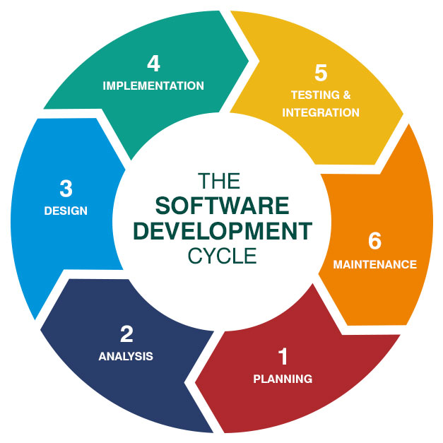

# Pod pokličkou SW inženýra (Arduino Day 2019)

Podklady pro přednášku z [Arduino Day 2019](http://robodoupe.cz/2019/arduino-day/) v Praze.

> Psaní programu je jen malý kousek skládačky. Opravdový *SW inženýr™* toho umí mnohem víc. V této přednášce se koukneme na některé věci z kuchyně SW inženýra, které by se mohly hodit i na takové to domácí programování…

## Osnova

* Co je SW proces
* Verzování zdrojového kódu
* Architektura a design aplikace
* Testování (Unit Test)
* Continuous Integration

-----

## Co je SW proces

------

## Verzování (nejen) zdrojového kódu

### Proč?

* **historie** - přístup ke všem `Ctrl+S` které jste kdy udělali
* **kooperace** - abyste si s parťákem nepřepsali změny
* **branches** - na pokusy
* **single point of true** - co není verzované jako by nebylo
* **záloha**

### GitHub

* nejen verzovací systém, ale i nástroj pro celý životní cyklus SW
* dokumentace a sdílení

Příklady:

* https://github.com/bastlirna/esp8266-board ([wiki](https://github.com/bastlirna/esp8266-board/wiki))
* https://github.com/bastlirna/esp8266-workshop
* https://github.com/bastlirna/esp8266-board-hal
* https://github.com/bastlirna/esp8266-board-app

### Tipy

* Všechny závislosti musí byt verzované nebo explicitně uvedené (např. verze knihoven)
* Primárně se verzuje zdrojový kód (text), ale obecně vše co je potřeba k sestaveni artefaktu
* Knihovny a ext. závislosti neverzovat pokud jsou dostupné pres uložiště (repozitory), které verzovani umožňuje (pio lib), v opačném případě raději verzovat kopii než googlem
* To co je v gitu by mělo stačit pro build

-----

## Vícevrstvá architektura

* https://github.com/bastlirna/esp8266-board-hal
* https://github.com/bastlirna/esp8266-board-app

💡 [PlatformIO](https://platformio.org/)

-----

## Unit Testy

* https://github.com/bastlirna/esp8266-board-app

-----

## Continuous Integration

* Build po každém commitu
* Build pro všechny prostředí, načisto
* Spuštění Unit testů na CI prostředí
* Uložení artefaktů (*.hex, *.elf)

Ukázka:

* https://github.com/bastlirna/esp8266-board-hal
* https://github.com/ah01/pio-advanced-sample

-----

